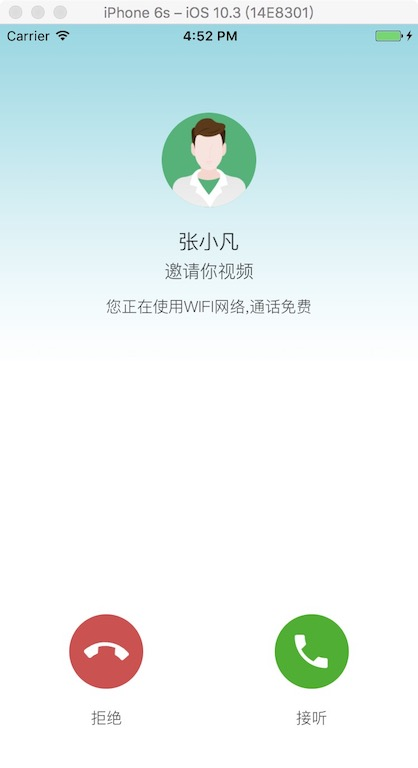

# react-native-agora-videochat

#### 正在开发中...  

进度:安卓视频呼入0.0.1 -- ios视频呼入0.0.1 -- ios视频呼出0.0.1

[](https://www.npmjs.com/package/react-native-agora-videochat)





## Getting started

`$ npm install react-native-agora-videochat --save`

#### ios使用说明

1.需在你所在的项目`Build Phases`中` Link Binary with Libraries`添加如下图的库(其中`AgoraRtcEngineKit.framework `为[声网ios库](https://www.agora.io/cn/blog/download/))


2.更改`Build Setting`中的`Enable Bitcode`为`NO`;

3.在 info.plist 进行授权操作:

将 Privacy - Camera Usage Description 设置为 use camera to start video call

将 Privacy - Microphone Usage Description 设置为 use microphone to start video call

### Mostly automatic installation

`$ react-native link react-native-agora-videochat`

### Documentation

#### Params

|Key | Description | Type | Default|
| --- | ----------- | ---- | ------ |
|remoteName  |对方的名称            |string  |""            |
|remoteHeader   |对方的头像地址            |string  |""             |
|channelKey       |声网的channelkey            |string  |""        |
|channelName |声网的channelName           |string   |""   |
|appId  |声网的appid            |string   |""   |
|callState      |呼叫状态(呼入'inCome'/呼出'outPut')            |string   |""   |
|netStatus       |网络状态('wifi'/'')            |string   |"" |
|introText              |呼叫时显示的介绍文字            |string   |"" |
|backgroundImage |呼入界面的背景图地址url           |string   |""   |
|hanginImage  |接听图片地址url            |string   |""   |
|hangupImage      |挂断图片地址url            |string   |""   |
|muteImage       |允许自己声音的图片地址url            |string   |"" |
|unmuteImage              |不允许自己声音的图片url            |string   |"" |
|switchcameraImage              |切换摄像头的图片url            |string   |"" |
|hangin       |接听视频呼叫            |function|                   |
|hangup        |视频内终止视频            |function|                   |
|hangupIncome        |拒绝视频呼叫            |function|                   |
|hangupCalling        |终止呼叫视频            |function|                   |
|hangupByPeer        |视频内对方终止视频            |function|                   |

#### Methods

|Name | Description | Type | Default|
| --- | ----------- | ---- | ------ |
|init         |init and pass parameters to viewer      |     |   |
|toggle       |show or hide viewer                     |     |   |
|show         |show viewer                             |     |   |
|hide         |hide viewer                             |     |   |
|isViewerShow |get status of viewer, return a boolean  |     |   |

## Usage
```javascript
import Viewer from 'react-native-agora-videochat';

// TODO: What to do with the module?
Viewer.init({
    remoteName:'张小凡',
    remoteHeader: '',
    channelKey: '',
    channelName: '',
    appId: '',
    callState: 'inCome',
    netStatus: 'wifi',
    introText: '邀请你视频',
    backgroundImage:'',
    hanginImage:'',
    hangupImage:'',
    muteImage:'',
    unmuteImage:'',
    switchcameraImage:'',
    hangin:(data)=>{
        console.log('---1---',data);
    },
    hangup:(data)=>{
        console.log('---2---',data);
    },
    hangupIncome:(data)=>{
        console.log('---3---',data);
        Viewer.hide();
    },
    hangupCalling:(data)=>{
        console.log('---4---',data);
    },
    hangupByPeer:(data)=>{
        console.log('---5---',data);
    },
});
Viewer.show();
```
  
